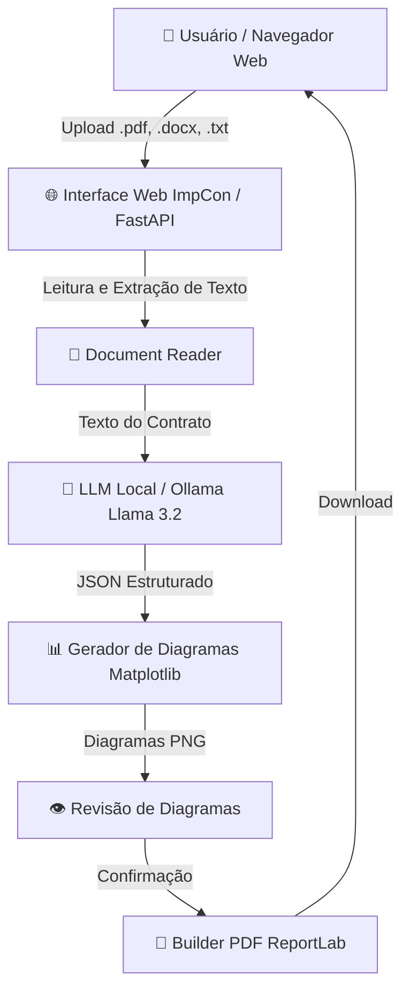

# 📑 ImpCon — Análise Visual & Inteligente de Contratos

[](https://python.org)
[](https://fastapi.tiangolo.com)
[](https://ollama.ai)
[](https://microsoft.com)
[](https://github.com/postrenan/ImpCon)

> **ImpCon** é uma solução completa para **análise automatizada, síntese inteligente e visualização gráfica de contratos e documentos jurídicos** rodando **100% localmente**, garantindo privacidade total dos dados sem envio de informações para servidores externos.

---

## 📥 Download Direto (Windows 1-Clique)

Para rodar no Windows **sem precisar instalar Python, Git ou dependências**, baixe o pacote executável portátil pronto:

👉 **[⚡ Baixar ImpCon v1.0.0 para Windows (.7z — 1.9 GB)](https://github.com/postrenan/ImpCon/releases/download/v1.0.0/ImpCon-Windows-x64.7z)**  
🔗 **[Ver todas as versões e arquivos na página de Releases](https://github.com/postrenan/ImpCon/releases)**

---

## ✨ Principais Funcionalidades

- 🔒 **100% Local & Privado**: Utiliza IA local (**Ollama / Llama 3.2**) sem enviar dados para a nuvem.
- 📊 **Geração de Diagramas Jurídicos**:
  - 🔗 **Relacionamento entre Partes**: Mapeia contratante, contratado, fiadores e testemunhas.
  - 📅 **Linha do Tempo (Timeline)**: Cronograma visual de vigência, entregas e marcos de pagamento.
  - 📋 **Fluxo de Obrigações**: Matriz de deveres agrupada por responsável com prazos.
  - 💰 **Valores Financeiros**: Comparativo de honorários, pagamentos e parcelidades.
  - ⚠️ **Mapa de Penalidades**: Classificação de sanções por nível de severidade (Alta, Média, Baixa).
- 📑 **Exportação de PDF Visual**: Converte a análise e os diagramas gráficos em um relatório PDF limpo e profissional.
- ⚡ **Auto-Updater Integrado (1-Clique)**: Atualização remota do código baixando apenas pacotes mínimos (~30 KB).
- 🪟 **Portável para Windows (1-Clique)**: Executável nativo (`ImpCon.exe`) que dispensa a instalação prévia de Python ou Ollama.

---

## 🏗️ Arquitetura do Sistema



---

## 🚀 Como Executar

### 🪟 No Windows (Executável 1-Clique)
1. Baixe o pacote portável `ImpCon-Windows-x64.7z` na página do projeto.
2. Descompacte a pasta em qualquer diretório.
3. Dê um duplo clique no arquivo **`ImpCon.exe`**.
4. O navegador abrirá automaticamente em `http://localhost:8500`.

### 🐧 No Linux / Ambiente de Desenvolvimento
1. Clone o repositório:
   ```bash
   git clone https://github.com/postrenan/ImpCon.git
   cd ImpCon
   ```
2. Baixe o modelo Llama 3.2 no Ollama:
   ```bash
   ollama pull llama3.2:3b
   ```
3. Instale as dependências e inicie o servidor:
   ```bash
   pip install -r requirements.txt
   ./run.sh
   ```
4. Acesse `http://localhost:8500` no seu navegador.

---

## 📁 Estrutura do Projeto

```
ImpCon/
├── app.py                   # Servidor FastAPI e rotas de processamento / atualizações
├── modules/
│   ├── reader.py            # Extrator de texto (.pdf, .docx, .txt, .md)
│   ├── extractor.py         # Conector Ollama LLM e parser de JSON
│   ├── diagrams.py          # Gerador visual de diagramas jurídicos (Matplotlib)
│   ├── pdf_builder.py       # Montador do PDF final (ReportLab)
│   └── updater.py           # Sistema de Auto-Updater remoto inteligente
├── static/
│   └── index.html           # Interface web reativa (HTML5, CSS3, SSE)
├── build/
│   ├── build_win.sh         # Script de compilação do pacote Windows x64
│   ├── launcher_win.c       # Código-fonte do executável ImpCon.exe (C WinMain)
│   └── create_update_pkg.sh # Gerador de atualizações leves (~30 KB)
├── requirements.txt         # Dependências do projeto Python
└── README.md                # Documentação oficial do projeto
```

---

## 🛠️ Tecnologias Utilizadas

- **Backend**: Python 3.11, FastAPI, Uvicorn, AsyncIO, HTTPX.
- **IA Local**: Ollama, Llama 3.2 (3B).
- **Processamento & Gráficos**: `pdfplumber`, `python-docx`, `reportlab`, `matplotlib`.
- **Frontend**: HTML5, Vanilla CSS, JavaScript (Server-Sent Events).
- **Launcher Windows**: C Nativo (`WinMain` com redirecionamento de handles de processo).

---

## 📜 Licença

Distribuído sob a licença **MIT**. Veja `LICENSE` para mais detalhes.

---
*Desenvolvido para análise jurídica ágil, segura e 100% privada.*
